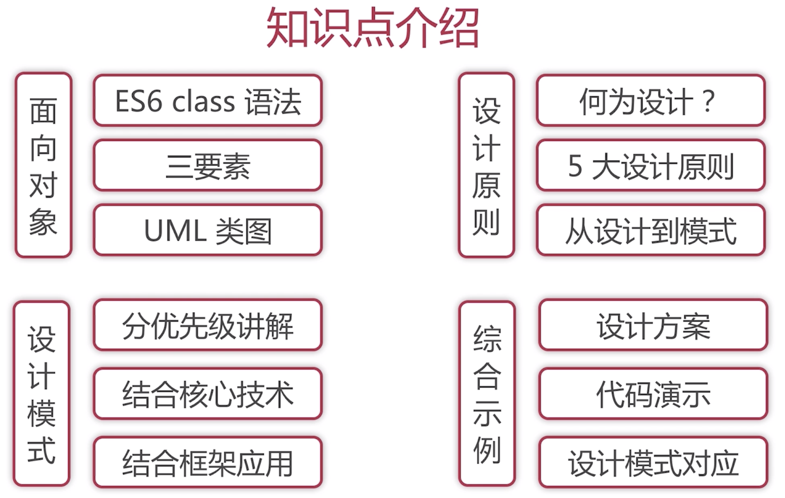

# javascript_design_patterns<!-- omit in toc -->
> javascirpt设计模式整理归纳

- [相关](#%E7%9B%B8%E5%85%B3)
- [学习记录](#%E5%AD%A6%E4%B9%A0%E8%AE%B0%E5%BD%95)
  - [第1章 课程介绍](#%E7%AC%AC1%E7%AB%A0-%E8%AF%BE%E7%A8%8B%E4%BB%8B%E7%BB%8D)
    - [概述](#%E6%A6%82%E8%BF%B0)
    - [知识点介绍](#%E7%9F%A5%E8%AF%86%E7%82%B9%E4%BB%8B%E7%BB%8D)
    - [目的](#%E7%9B%AE%E7%9A%84)
  - [第2章 面向对象](#%E7%AC%AC2%E7%AB%A0-%E9%9D%A2%E5%90%91%E5%AF%B9%E8%B1%A1)
  - [第3章 设计原则](#%E7%AC%AC3%E7%AB%A0-%E8%AE%BE%E8%AE%A1%E5%8E%9F%E5%88%99)
  - [第4章 工厂模式](#%E7%AC%AC4%E7%AB%A0-%E5%B7%A5%E5%8E%82%E6%A8%A1%E5%BC%8F)
  - [第5章 单例模式](#%E7%AC%AC5%E7%AB%A0-%E5%8D%95%E4%BE%8B%E6%A8%A1%E5%BC%8F)
  - [第6章 适配器模式](#%E7%AC%AC6%E7%AB%A0-%E9%80%82%E9%85%8D%E5%99%A8%E6%A8%A1%E5%BC%8F)
  - [第7章 装饰器模式](#%E7%AC%AC7%E7%AB%A0-%E8%A3%85%E9%A5%B0%E5%99%A8%E6%A8%A1%E5%BC%8F)
  - [第8章 代理模式](#%E7%AC%AC8%E7%AB%A0-%E4%BB%A3%E7%90%86%E6%A8%A1%E5%BC%8F)
  - [第9章 外观模式](#%E7%AC%AC9%E7%AB%A0-%E5%A4%96%E8%A7%82%E6%A8%A1%E5%BC%8F)
  - [第10章 观察者模式](#%E7%AC%AC10%E7%AB%A0-%E8%A7%82%E5%AF%9F%E8%80%85%E6%A8%A1%E5%BC%8F)
  - [第11章 迭代器模式](#%E7%AC%AC11%E7%AB%A0-%E8%BF%AD%E4%BB%A3%E5%99%A8%E6%A8%A1%E5%BC%8F)
  - [第12章 状态模式](#%E7%AC%AC12%E7%AB%A0-%E7%8A%B6%E6%80%81%E6%A8%A1%E5%BC%8F)
  - [第13章 其他设计模式](#%E7%AC%AC13%E7%AB%A0-%E5%85%B6%E4%BB%96%E8%AE%BE%E8%AE%A1%E6%A8%A1%E5%BC%8F)
  - [第14章 综合应用](#%E7%AC%AC14%E7%AB%A0-%E7%BB%BC%E5%90%88%E5%BA%94%E7%94%A8)
  - [第15章 课程总结](#%E7%AC%AC15%E7%AB%A0-%E8%AF%BE%E7%A8%8B%E6%80%BB%E7%BB%93)

## 相关
1. [幕布](https://mubu.com/doc/qSgtiCBCP0)
2. [github](https://github.com/GivenCui/javascript_design_patterns)
3. [mooc](https://coding.imooc.com/learn/list/255.html)

## 学习记录
### 第1章 课程介绍
> 先基础后实践, 先"设计"后"模式"
#### 概述
1. 做什么? -- 深入JS设计模式
2. 哪些部分? -- 面向对象, 设计原则, 设计模式
3. 技术? -- 面向对象, UML类图, ES6
#### 知识点介绍

#### 目的
1. 面向对象思想, UML类图
2. 5大设计原则, 23种设计模式
3. 能应对前端面试中相关面试题
### 第2章 面向对象
搭建开发环境
什么是面向对象
UML类图
### 第3章 设计原则
### 第4章 工厂模式
### 第5章 单例模式
### 第6章 适配器模式
### 第7章 装饰器模式
### 第8章 代理模式
### 第9章 外观模式
### 第10章 观察者模式
### 第11章 迭代器模式
### 第12章 状态模式
### 第13章 其他设计模式
### 第14章 综合应用
### 第15章 课程总结
